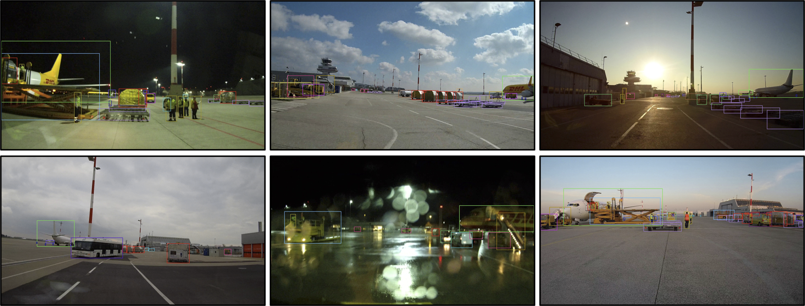

# The Apron Dataset


This repository provides all relevant information and utility scripts of the Apron Dataset, which focuses on training and evaluating classification and detection models for airport-apron logistics. 
A detailed description can be found in the corresponding [publication](https://openaccess.thecvf.com/content/ACCV2022W/MLCSA/papers/Steininger_Towards_Scene_Understanding_for_Autonomous_Operations_on_Airport_Aprons_ACCVW_2022_paper.pdf). 
The image data and annotations are available on request at [wilddash.cc/aprondataset](https://wilddash.cc/aprondataset).  


## Annotation Format
Annotations are provided as csv files for each image, defining object instances by a bounding box, label id and the following meta parameters:
* occluded: non-occluded (0), occluded (1)
* atmosphere: clear (0), light rain (1), heavy rain (2), fog (3), snow (4)
* lighting: sunny (0), diffuse (1), artificial (2)
* timeofday: day (0), twilight (1), night (2)
* degradation: low (0), high (1)

The specifications of label ids, mappings and visualization colors are defined in [datasets.py](scripts/aprondataset/datasets.py).


## Dataset Variants
The provided dataset contains fine-grained annotations for 43 categories (ApronFine). Use [map_dataset.py](scripts/aprondataset/map_dataset.py) to map them to arbitrary target datasets. Mappings of the default variants ApronTop and ApronCoarse are provided.  


## Visualization
Use [visualize_annotations.py](scripts/aprondataset/visualize_annotations.py) to overlay annotations as colored bounding boxes on all images in a given directory.


## Licence
The Apron Dataset is released to academic and non-academic entities for non-commercial purposes such as academic research, teaching, scientific publications or personal experimentation ([LICENCE](LICENCE)).


## Citing
If you use the dataset for your research, please use the following BibTeX entry:

```BibTeX
@InProceedings{Steininger_2022_ACCV,
    author    = {Steininger, Daniel and Kriegler, Andreas and Pointner, Wolfgang and Widhalm, Verena and Simon, Julia and Zendel, Oliver},
    title     = {Towards Scene Understanding for Autonomous Operations on Airport Aprons},
    booktitle = {Proceedings of the Asian Conference on Computer Vision (ACCV) Workshops},
    month     = {December},
    year      = {2022},
    pages     = {147-163}
}
```
